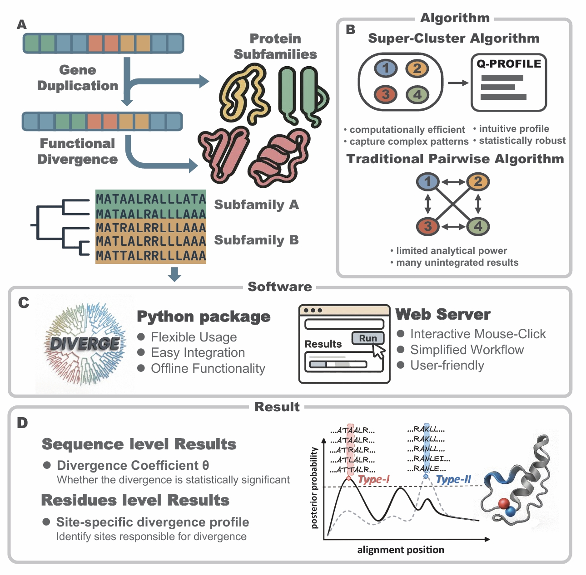

# DIVERGE v4

[](LICENSE)

DIVERGE v4 is a Python package designed for large-scale analysis of functional divergence across multi-gene families. It is a major upgrade of the widely used DIVERGE software, incorporating a novel Super-Cluster algorithm, a modular Python structure, and a user-friendly web server. This package allows for the identification of amino acid sites undergoing significant evolutionary shifts, helping to uncover functional divergence after gene duplication.



## Features

- **Novel Super-Cluster Algorithm**: A statistically robust method designed for large-scale analysis of functional divergence in multi-gene families, replacing numerous one-to-one comparisons with a single computation
- **Modular Python Package**: Built for scalability and seamless integration into bioinformatics workflows, with 10 customizable modules for functional divergence analysis
- **Web Interface**: A user-friendly web server developed using the Streamlit framework, making the package accessible even without programming knowledge
- **Comprehensive Database**: Analysis results of 4,540 human protein families (comprising 10,133 human genes and 215,480 protein sequences), searchable by UniProtKB, Ensembl, HGNC IDs, or gene names

## Installation

To install the DIVERGE v4 Python package, use pip:

```bash
pip install diverge4
```

If you prefer to compile the package from source using setup.py, you will need to install the pybind11 library, which provides the C++ bindings for Python used in this package. You can install it via pip:

```bash
pip install pybind11
```

Once `pybind11` is installed, you can compile DIVERGE v4 by running the following commands:

```bash
git clone https://github.com/zjupgx/diverge4.git
cd diverge4
python setup.py install
```

`pybind11` is necessary because DIVERGE v4 uses C++ for its core data structures and computationally intensive tasks, which are exposed to Python via `pybind11`.

## Quick Start

### Example Usage

Here's a simple example demonstrating how to use DIVERGE v4 for functional divergence analysis:

```python
from diverge import Gu99
# Perform DIVERGE's Gu99 analysis
gu99 = Gu99("./test_data/CASP.aln","./test_data/cl1.tree","./test_data/cl2.tree","./test_data/cl3.tree")
# View the results
result = gu99.results()
print(result)
```

For more detailed examples, check the [tutorials](./Tutorial.ipynb) and [casestudy](./CaseStudy/ERBB_analysis.ipynb).

## Main Functional Modules

DIVERGE v4 provides various independent computing processes to create custom pipelines for functional divergence analysis. Below are the main functions:

| **Function** | **Description** |
|--------------|-----------------|
| **Type-I Divergence (Gu99 method)** | Detect type-I functional divergence using the Gu (1999) method |
| **Type-I Divergence (Gu2001 method)** | Detect type-I functional divergence using the Gu (2001) method. Requires phylogenetic tree file with branch length data |
| **Type-II Divergence** | Detect type-II functional divergence of gene families |
| **Super-Cluster Analysis** | Perform large-scale functional divergence analysis using the Super-Cluster method, designed for multi-gene families |
| **Rate Variation Among Sites (RVS)** | Estimate rate variations among sites for a given cluster. **Only one cluster is allowed per run** |
| **Functional Distance Analysis** | Estimate type-I functional distance between pairs of clusters and compute type-I functional branch lengths. **Requires at least three clusters** |
| **FDR for Predictions** | Calculate the false discovery rate of functionally diverging sites |
| **Asymmetric Test for Type-I Functional Divergence** | Test whether the degree of type-I functional divergence differs between duplicate genes. **Requires three clusters** |
| **Effective Number of Sites** | Estimate the effective number of sites related to type-I or type-II functional divergence. **Requires two clusters** |
| **Gene-Specific Type-I Analysis** | Site-specific posterior profile for predicting gene-specific type-I functional divergence-related sites. **Requires three clusters** |

## Web Server and Database

The web server (https://pgx.zju.edu.cn/diverge) provides:

- **Interactive Analysis**: Upload MSA and phylogeny files for functional divergence analysis
- **Comprehensive Database**: Access pre-computed analyses of 4,540 human protein families
- **Search Functionality**: Query the database using UniProtKB ID, Ensembl ID, HGNC ID, or gene name
- **Functional Annotations**: Access Gene Ontology terms, pathways, and protein class assignments for human proteins
- **Visualization Tools**: Interactive visualization of results and amino acid sites

## Citation

If you use DIVERGE in your research, please cite:

```

```

## License

DIVERGE v4 is licensed under the MIT License. See the [LICENSE](LICENSE) file for more details.
